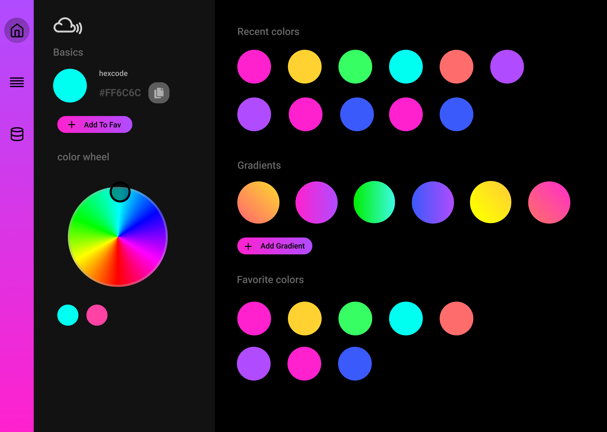
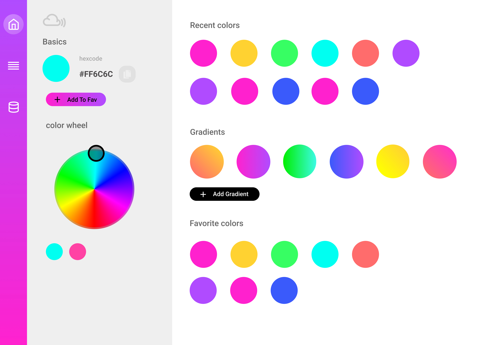
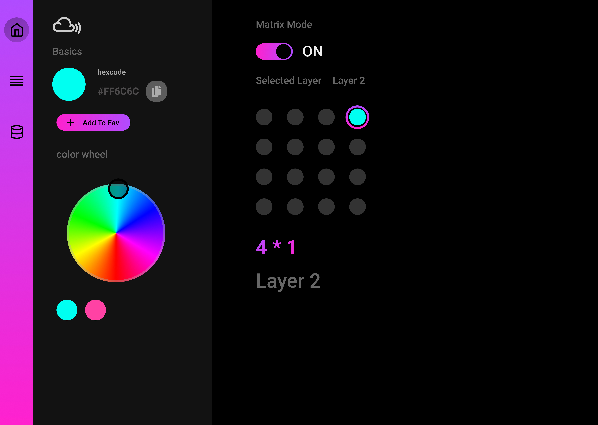
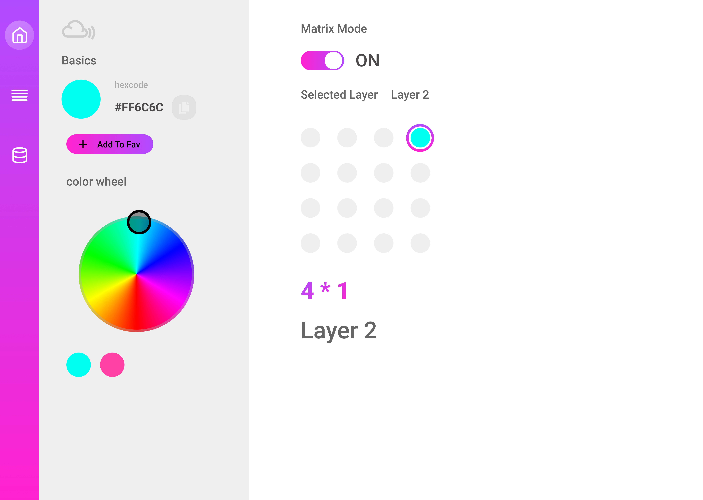

# iot
internet of things

Application for changing light color  
passing hexColor code by Application using firebase as backend  

some advance features are to be integrated such as animations  
lighting effects and Displaying Alphabets

<b>UI for Desktop Screen</b>

<b>Color Library Screen</b>

<b>Main Control Pannel</b>

<b>Matrix Mode</b>

